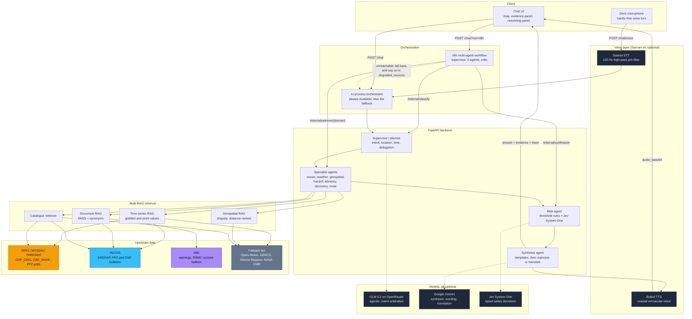
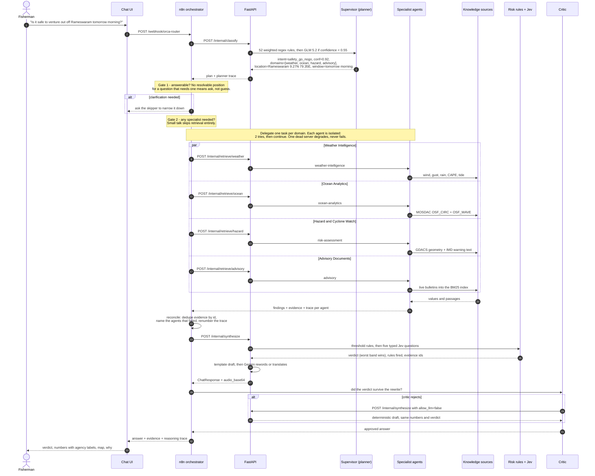
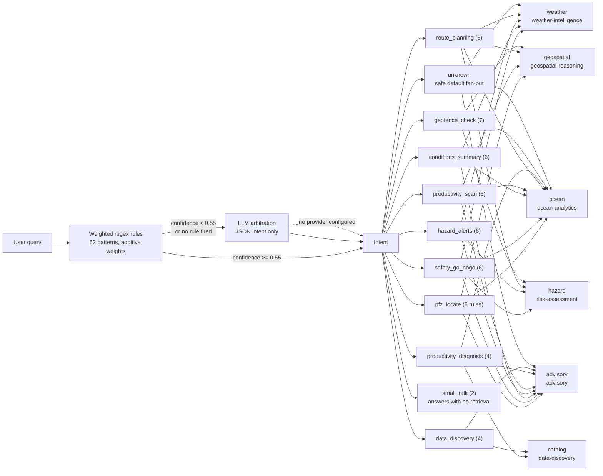
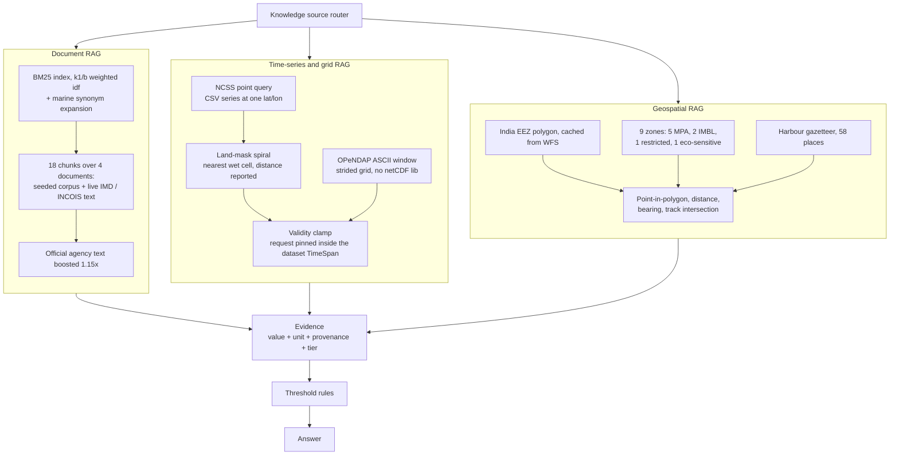
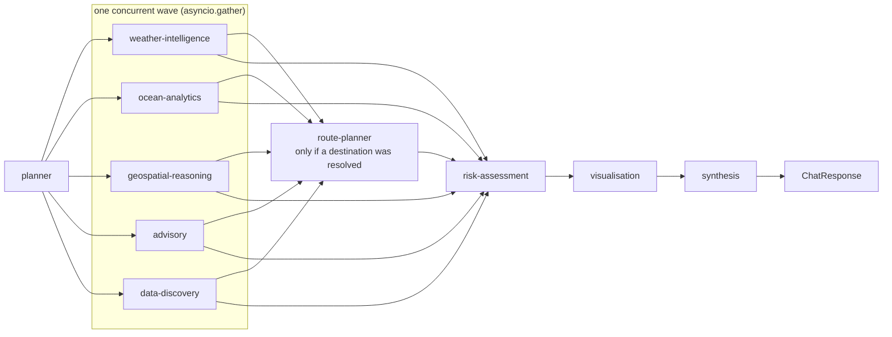
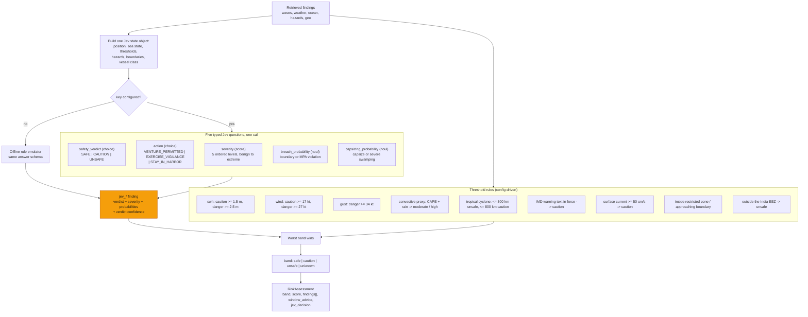
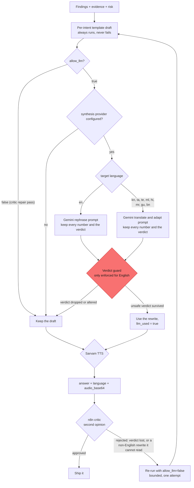
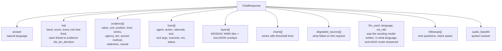
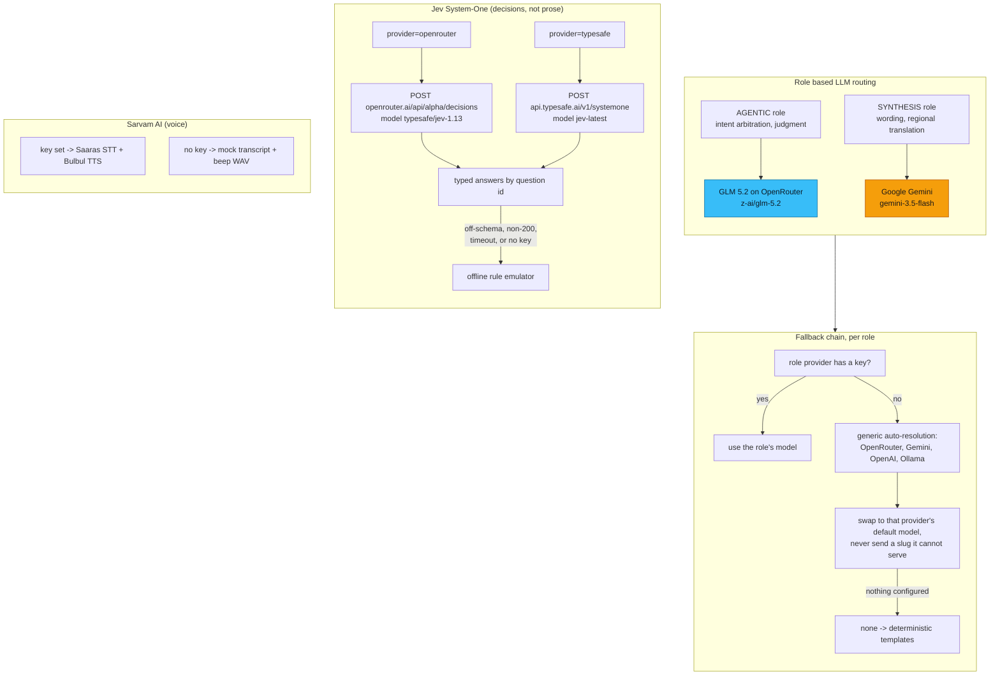
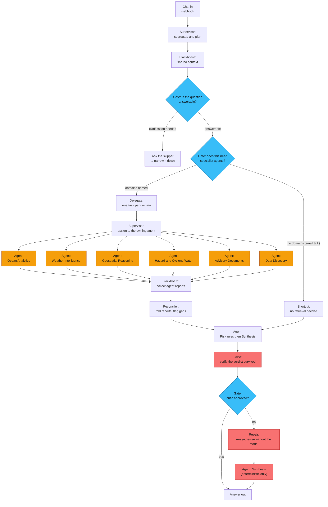

# ORCA architecture

ORCA answers marine questions in natural language by segregating the query,
routing it to the knowledge sources that can actually answer it, retrieving from
official Indian agency services, applying explicit safety rules, and returning
the answer together with the evidence and the reasoning behind it.

Every number in the diagrams below was read out of the running system on
2026-09-22 (`/health`, a live `POST /chat`, and the 21-test suite). Where the
code and an earlier version of this document disagreed, the code won.

## 1. System overview



## 2. Request flow: the multi-agent orchestration

A supervisor plans, six specialists retrieve in parallel against a shared
blackboard, a reconciler folds their reports together, rules decide the verdict,
and a critic verifies the answer before it ships. The same graph runs in-process
and in n8n.



The observed run of this exact query returned `intent=safety_go_nogo`,
`confidence=0.92`, band `unsafe`, 22 evidence items and 16 trace steps, with
`gdacs` listed in `degraded_sources`.

### Why this is orchestration and not a pipeline

1. **Two supervisor gates.** Unanswerable questions go back for clarification
   and small talk skips retrieval. Neither wakes an agent or a government server.
2. **Agents are isolated.** Every specialist node carries
   `onError: continueRegularOutput` with two tries. The reconciler names what was
   lost so the answer can admit the gap.
3. **A shared blackboard.** The plan is resolved once. No specialist re-derives
   the place or the window, so they cannot disagree about what was asked.
4. **A critic with authority.** If a rewrite loses an unsafe verdict, or an
   answer arrives with no evidence, the critic rejects it and forces one
   deterministic re-run with `allow_llm: false`. Bounded to a single attempt.

## 3. Intent segregation to knowledge source

The classifier is a weighted keyword model: 52 regex rules, additive weights,
highest total wins. Deterministic and explainable. The LLM is consulted only
when lexical confidence is below 0.55, and the trace records which one decided.



Each of the six domains maps 1:1 onto `/internal/retrieve/{domain}`, which is
what lets the n8n Switch node drive retrieval branch by branch. A separate table
of 11 time-hint patterns resolves "tomorrow morning", "tonight", "this week" and
the rest into a concrete UTC window.

## 4. Multi-RAG: three retrievers, not one

A single vector store cannot answer "how far is the IMBL" or "what is the SST at
this point". ORCA runs three retrievers with different index types behind one
router.



Dense retrieval via Qdrant is optional (`backend/requirements-optional.txt`).
With it absent, `/health` reports `vector_rag.mode: lexical-bm25`, which is the
verified default.

## 5. Source precedence and degradation

Every value carries the tier it came from. The UI shows it, so a user can see
when an answer rests on a fallback rather than on an Indian official product.


A connector never raises into the agent layer. It returns `None` or an empty
list, increments its own failure counter, and the failure surfaces in
`degraded_sources` on the response and under `sources` in `/health`. Retries
give up immediately on 4xx and back off on 5xx.

## 6. Agent collaboration on one request

Retrieval agents run concurrently because each waits on a different government
server. Risk, visualisation and synthesis are strictly ordered after them.



Each agent runs inside `_safe_run`. An agent that raises is isolated: the
exception is logged as a `failed` trace step, the remaining agents continue, and
the answer states what is missing. One dead upstream never sinks a request.

## 7. Safety verdict: threshold rules, then a structured judgment

The verdict is computed in code. The threshold rules read retrieved values and
each rule that fires is recorded with the evidence ids that triggered it. The
worst band wins; bands are never averaged, so one gale warning is not cancelled
out by calm seas.

Alongside them runs Jev, TypeSafe AI's System One model. Jev is not a chat model
and does not generate prose: you send one `state` plus a map of typed
`questions`, and it returns typed `answers` under the same ids with calibrated
probabilities. ORCA asks it five questions in a single call.



Answer shapes, which are not uniform and matter when reading the code:

| primitive | request `criteria` | answer carries |
|---|---|---|
| `choice` | map of option to rubric text | `choice`, full `probabilities` map, `confidence` |
| `score` | ordered array of 2 to 10 level descriptions | `score` as a weighted float over level indices, `legend`, `probabilities`, `confidence` |
| `noul` | optional `{true, false}` descriptions | `noul` only, a yes probability. **No confidence field.** |

ORCA normalises the severity score by the number of levels minus one to reach
0-100. Any off-schema verdict, any non-200, and any transport error falls through
to the emulator rather than reaching the risk agent.

Two caveats a reviewer should know, both visible in a live response:

- Jev re-derives a verdict from the same wave, wind and cyclone numbers the
  threshold rules already used, so it can disagree with them. On the Rameswaram
  run the rules returned `unsafe` (high convective risk) while the emulator
  returned `SAFE / VENTURE_PERMITTED`. Worst-band-wins keeps the conservative
  verdict, but both appear in `risk.findings`.
- `risk.score` is `worst band weight + min(8 x bad findings, 15)`, so any single
  unsafe finding saturates it at 100. Read `band` and `findings`, not the score.

## 8. Synthesis, the verdict guard, and the critic



The in-process guard (`SynthesisAgent._verdict_survived`) only fires when the
band is `unsafe`. For English it requires one of "do not", "don't", "avoid",
"stay in", "not safe", "unsafe", "remain in harbour", "postpone" to be present in
the rewrite. **For any other language it only checks that the text is longer than
10 characters**, so a translated rewrite can currently soften or flip an unsafe
verdict. This is a known defect, recorded in the README limits, not a design
decision.

The n8n critic partially compensates: because it cannot read a translated answer
either, it refuses to approve any non-English rewrite of an `unsafe` verdict and
forces the deterministic draft instead. That guard exists only on the n8n path,
so `POST /chat` without `?via=n8n` is still exposed.

## 9. Voice pipeline (Sarvam AI, optional)

```mermaid
sequenceDiagram
    autonumber
    actor U as Fisherman on deck
    participant UI as Chat UI
    participant API as FastAPI
    participant AF as AcousticFilter
    participant SV as Sarvam AI
    participant ORC as Orchestrator

    U->>UI: speaks in Kannada over engine noise
    UI->>API: POST /chat/voice (wav or audio_base64)
    API->>AF: 120 Hz single-pole high-pass
    Note over AF: suppresses 40-250 Hz diesel rumble;<br/>passthrough if not 16-bit RIFF PCM
    AF->>SV: Saaras speech-to-text
    alt SARVAM_API_KEY set
        SV-->>API: transcript + detected language_code
    else no key, or the call fails
        SV-->>API: canned sample transcript,<br/>provider = mock-saaras-offline
    end
    API->>ORC: ChatRequest(message=transcript, language=detected locale)
    ORC-->>API: ChatResponse with the deterministic verdict
    API->>SV: Bulbul text-to-speech in the detected language
    alt key set
        SV-->>API: audio, provider = sarvam-bulbul
    else no key
        SV-->>API: synthetic 440 Hz WAV,<br/>provider = mock-bulbul-offline
    end
    API-->>UI: answer + audio_base64
    UI-->>U: spoken answer, eyes-free
```

Language handling, as implemented:

| Layer | Languages |
|---|---|
| Script auto-detect from typed text | hi, ta, ml, te, gu, bn, kn (Devanagari resolves to hi, so Marathi is reported as Hindi) |
| LLM translation prompts | en, hi, bn, gu, kn, ml, mr, ta, te |
| Sarvam locale map | en, hi, bn, gu, kn, ml, mr, or, pa, ta, te |

Two things to keep in mind when demoing: TTS runs on **every** `/chat`
response, not only voice turns, and with no Sarvam key the mock placeholder beep
was 69.5% of a 122 kB response. The offline STT mock returns a fixed sample
sentence regardless of the audio supplied.

## 10. Explainability: what ships with every answer



## 11. API surface

| method | path | purpose |
|---|---|---|
| POST | `/chat` | full pipeline, in-process |
| POST | `/chat?via=n8n` | same, routed through the n8n workflow, falls back in-process |
| POST | `/chat/voice` | STT, then the full pipeline, then TTS |
| POST | `/api/voice/stt` | transcribe only |
| POST | `/api/voice/tts` | synthesise speech only |
| POST | `/internal/classify` | stage 1: segregate intent, name the knowledge sources |
| POST | `/internal/retrieve/{domain}` | stage 2: retrieve from one source |
| POST | `/internal/synthesize` | stages 3 and 4: risk rules, then the answer |
| GET | `/knowledge-sources` | what each domain is and where it reads from |
| GET | `/health` | index sizes, per-source health, LLM / Jev / Sarvam status |

None of these are authenticated. That is acceptable on localhost and nowhere
else. `host` defaults to `0.0.0.0`, and CORS does not restrain non-browser
clients, so put auth in front of the API and narrow `ORCA_CORS_ORIGINS` before
exposing it.

## 12. Model routing: one job, one model

Three external AI services, all optional, all off by default. The system answers
every supported query without any of them.



Why split the roles: the two jobs have opposite requirements. Intent arbitration
is a reasoning problem where a wrong route wastes a whole retrieval fan-out, so
it gets a reasoning model. Rewording a draft that is already factually complete
is a fluency and multilingual problem where latency is felt by the user, so it
gets a fast Google model. Both are pinned per role rather than sharing one
global model.

`ORCA_LLM_PROVIDER` still gates everything: `none` disables both roles, `ggl` is
an alias for `gemini`. The fallback deliberately swaps the model when it swaps
the provider, so a Gemini-only deployment never tries to send `z-ai/glm-5.2` to
Google.

Jev is billed per input token with output free, and TypeSafe documents 70 to
500 ms responses, so it is cheap enough to call on every safety verdict. Both
transports share one wire protocol; only the path and the model alias differ.

## 13. Repository layout

```
ORCA/
  backend/orca/
    main.py                 FastAPI app, /chat, /chat/voice, /api/voice/*, /internal/*
    services.py             one container: connectors, retrievers, LLM, sessions
    schemas.py              Evidence, Provenance, TraceStep, RiskAssessment, ChatResponse
    config.py               settings, all with working defaults
    llm.py                  role routed LLM: GLM 5.2 agentic, Gemini synthesis, template fallback
    voice.py                Sarvam Saaras STT, Bulbul TTS, 120 Hz acoustic pre-filter
    jev.py                  Jev System-One decisions via OpenRouter, offline emulator fallback
    connectors/             mosdac, incois, imd, openmeteo, gdacs, marine_regions, nasa
    rag/
      router.py             intent segregation and knowledge-source routing
      vector_rag.py         BM25 document retrieval
      geo_rag.py            spatial retrieval and geofencing
      timeseries_rag.py     point and grid retrieval with source precedence
    agents/
      planner.py            intent, location, time, task decomposition
      ocean.py              ocean analytics + weather intelligence
      geo.py                geospatial reasoning + route planning
      risk.py               hazard retrieval + threshold rules + Jev judgment
      advisory.py           document retrieval + dataset discovery
      viz.py                map layers and charts
      synthesis.py          templated draft, LLM rephrase or translate, verdict guard, TTS
      orchestrator.py       runs the task graph
  frontend/index.html       chat UI, no build step, all API text HTML-escaped
  knowledge/                seeded advisory corpus indexed by the document RAG
  data/layers/              zone GeoJSON, cached EEZ
  n8n/workflows/            orca_router.json, the 24 node multi-agent orchestrator
  tests/                    29 tests: voice, Jev protocol, LLM role routing, API smoke
  scripts/verify_e2e.py     runs the eight sample queries and asserts routing
  docs/                     this file and DATA_SOURCES.md
```

## 14. The n8n orchestration graph

`n8n/workflows/orca_router.json`, 24 nodes. This is the node graph as imported,
so it can be read next to the canvas.



Each of the six specialist nodes sets `retryOnFail` with two tries,
`alwaysOutputData`, and `onError: continueRegularOutput`, which is what makes the
fan-out survive a dead upstream. The merge node declares six inputs so it waits
for every branch before the reconciler runs.

## 15. Verified state and known gaps

Confirmed on 2026-09-22 against a running instance:

| Check | Result |
|---|---|
| `python -m pytest tests -q` | 29 passed, hermetic (a real `.env` cannot change the outcome) |
| `scripts/verify_e2e.py` | all checks passed across 8 sample queries |
| Warm-up | 18 knowledge chunks, 9 zone features, EEZ loaded |
| Gazetteer | 58 places |
| `POST /chat` sample query | HTTP 200, 22 evidence items, 16 trace steps |
| `POST /internal/synthesize` with `allow_llm=false` | HTTP 200, rewrite step reported `skipped` |
| Jev live call | `jev-openrouter`, answered as `typesafe/jev-1.13-20260917`: `CAUTION` at confidence 0.73, distribution `{CAUTION 0.82, UNSAFE 0.17, SAFE 0.01}`, severity 50.2/100, capsizing noul 0.48 |
| Worst-band-wins | rules said `unsafe`, Jev said `CAUTION`, final band stayed `unsafe` |
| GLM 5.2 rewrite | `llm_used: true` and the unsafe verdict survived ("Do not venture out off Rameswaram tomorrow morning") |
| n8n workflow | 24 nodes, no dangling or unreachable nodes, 6 isolated agents |
| Marine Regions WFS | 200, EEZ polygon cached to disk |
| GDACS | failing, `bad json` on an empty body |

Open gaps, in the order they matter:

1. The non-English verdict guard in `synthesis.py` is effectively a length check,
   so a translated rewrite can soften an unsafe verdict. The n8n critic blocks
   this on its own path; plain `POST /chat` is still exposed.
2. GDACS returns an empty body, so the cyclone distance rule cannot fire. The
   failure is reported in `degraded_sources` but nothing else compensates.
3. Jev is a second opinion over the same inputs and can contradict the threshold
   rules in the same response. Worst-band-wins keeps this safe but noisy.
4. `min_zone_dist` in `risk.py` is the nearest zone of any kind, so a benign MPA
   a few km away raises the modelled breach probability.
5. TTS and the acoustic filter are per-sample Python loops running inside async
   request handlers, and TTS runs on every text request.
6. No authentication on any endpoint.
7. The core is untested: no tests cover the intent router, BM25, the geofence
   index, the grid readers or the risk rules.

See the README for the full list, including the data-side limits.
