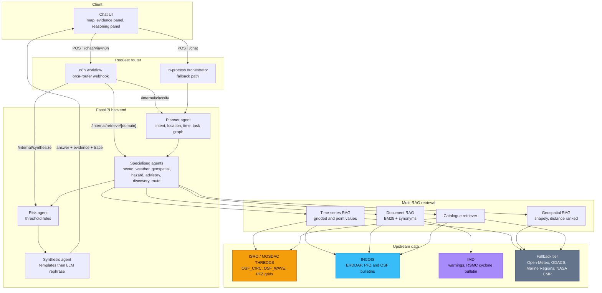
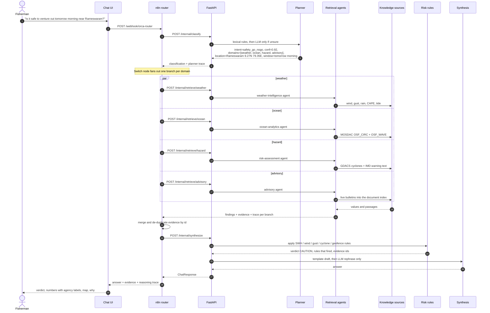
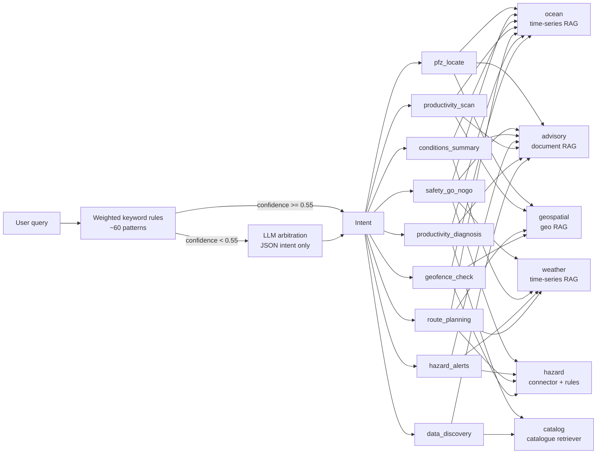
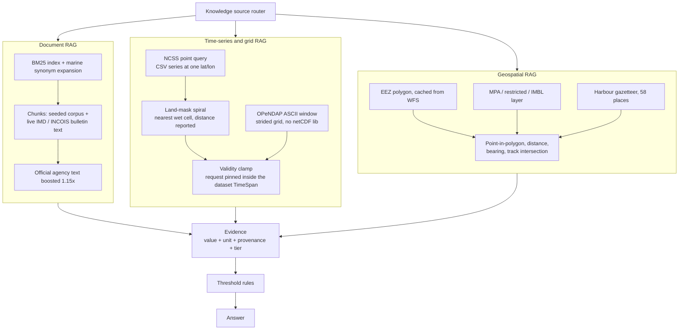
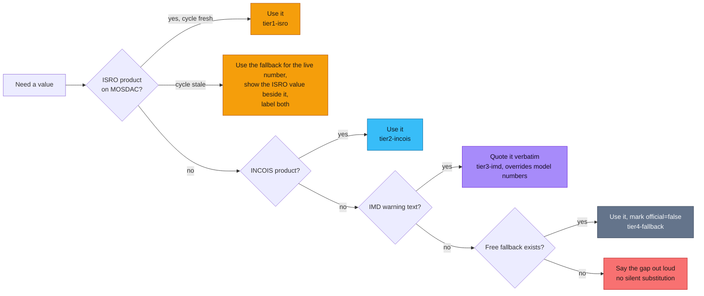
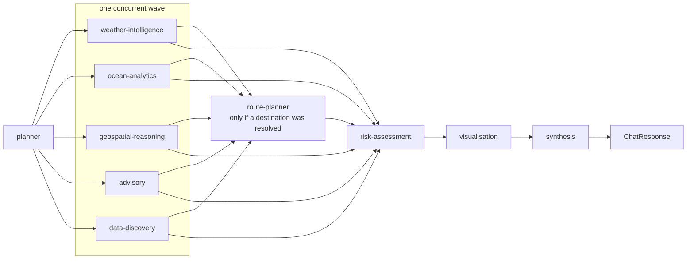
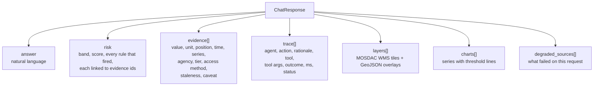

# ORCA architecture

ORCA answers marine questions in natural language by segregating the query,
routing it to the knowledge sources that can actually answer it, retrieving from
official Indian agency services, applying explicit safety rules, and returning
the answer together with the evidence and the reasoning behind it.

## 1. System overview



## 2. Request flow: segregate, route, retrieve, synthesise

This is the path the problem statement cares about. The query is classified
first, and classification decides which knowledge sources get called. Nothing is
retrieved speculatively.



## 3. Intent segregation to knowledge source

The classifier is a weighted keyword model, deterministic and explainable. The
LLM is consulted only when lexical confidence is below 0.55, and the trace
records which one decided.



## 4. Multi-RAG: three retrievers, not one

A single vector store cannot answer "how far is the IMBL" or "what is the SST at
this point". ORCA runs three retrievers with different index types behind one
router.



## 5. Source precedence and degradation

Every value carries the tier it came from. The UI shows it, so a user can see
when an answer rests on a fallback rather than on an Indian official product.



## 6. Agent collaboration on one request

Retrieval agents run concurrently because each waits on a different government
server. Risk, visualisation and synthesis are strictly ordered after them.



## 7. Explainability: what ships with every answer



## 8. Repository layout

```
ORCA/
  backend/orca/
    main.py                 FastAPI app, /chat and the /internal/* stages for n8n
    services.py             one container: connectors, retrievers, LLM, sessions
    schemas.py              Evidence, Provenance, TraceStep, ChatResponse
    config.py               settings, all with working defaults
    llm.py                  optional Ollama / OpenAI / Gemini, template fallback
    connectors/             mosdac, incois, imd, openmeteo, gdacs, marine_regions, nasa
    rag/
      router.py             intent segregation and knowledge-source routing
      vector_rag.py         BM25 document retrieval
      geo_rag.py            spatial retrieval and geofencing
      timeseries_rag.py     point and grid retrieval with source precedence
    agents/
      planner.py            intent, location, time, task decomposition
      ocean.py              ocean analytics + weather intelligence
      geo.py                geospatial reasoning + route planning
      risk.py               hazard retrieval + threshold rules
      advisory.py           document retrieval + dataset discovery
      viz.py                map layers and charts
      synthesis.py          templated draft, LLM rephrase, verdict guard
      orchestrator.py       runs the task graph
  frontend/index.html       chat UI, no build step
  knowledge/                seeded advisory corpus indexed by the document RAG
  data/layers/              zone GeoJSON, cached EEZ
  n8n/workflows/            orca_router.json
  scripts/verify_e2e.py     runs the eight sample queries and asserts routing
  docs/                     this file and DATA_SOURCES.md
```
